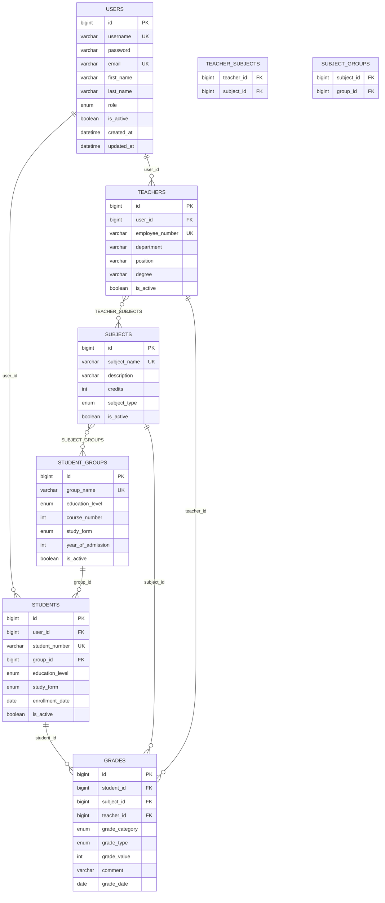
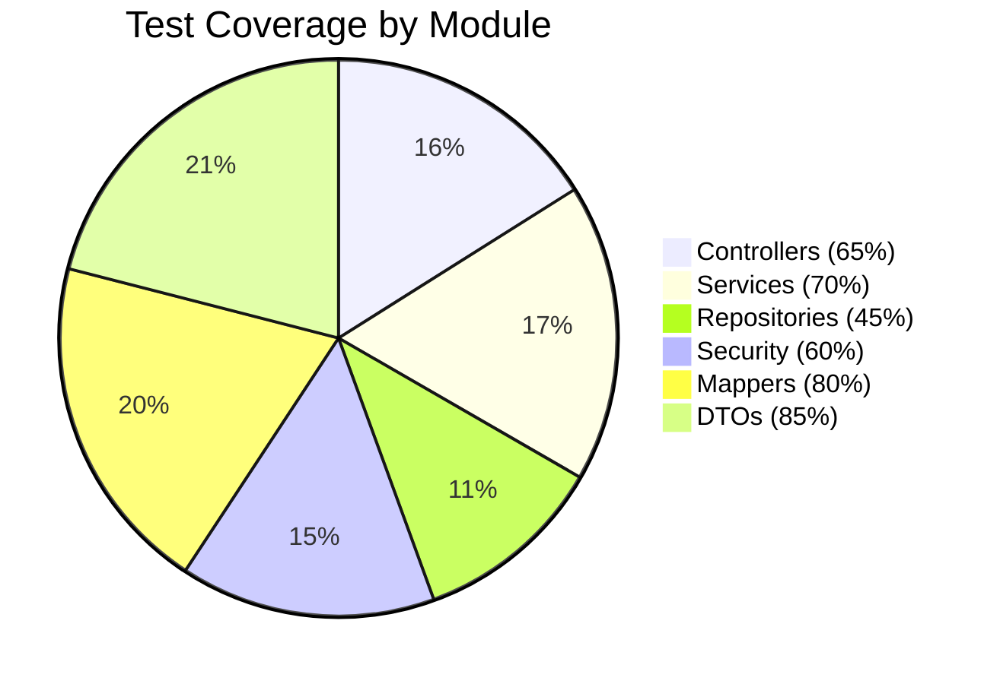

<div align="center">

# 🎓 Electronic Department System 

### *Комплексна система управління електронним деканатом університету*

[](https://www.oracle.com/java/)
[](https://spring.io/projects/spring-boot)
[](https://www.mysql.com/)
[](https://developer.mozilla.org/en-US/docs/Web/JavaScript)

[](https://maven.apache.org/)
[](https://jwt.io/)
[](https://sonarqube.org/)
[](LICENSE)


</div>

---

## 📖 Про проект

Electronic Department System — це **сучасна веб-система управління електронним деканатом університету**, створена для повної автоматизації навчального процесу. Система забезпечує ефективне управління студентами, викладачами, навчальними дисциплінами та академічними оцінками з використанням сучасного технологічного стеку.

<div align="center">
  
### 🔥 Особливості проекту

| 🎯 **Особливість**    | 📊 **Показник**          |
|:---------------------:|:------------------------:|
| **Test Coverage**     | **62.4%** (SonarQube)    |
| **Unit Tests**        | **317 автотестів**       |
| **API Endpoints**     | **123 endpoints**        |
| **Ролі користувачів** | **5 рівнів доступу**     |
| **Архітектура**       | **Unit of Work Pattern** |

</div>

---

## 🏗️ Автор проекту

<div align="center">

**Herman Lukyanov**  
*Full-Stack Developer & System Architect*

📧 *Для зв'язку та пропозицій щодо розвитку системи*

</div>

---

## 🚀 Технологічний стек

<div align="center">

### Backend Technologies


### Frontend Technologies  


### Database & Storage


### Development Tools


### Testing & Quality


</div>

### 📋 Детальна специфікація технологій

| 🔧 **Категорія**   | 🛠️ **Технологія**       | 📝 **Версія** | 💼 **Призначення**                   |
|:-------------------|:------------------------|:--------------|:-------------------------------------|
| **Core Framework** | Spring Boot             | 3.2.1         | Основний фреймворк застосунку        |
| **Language**       | Java                    | 17 (LTS)      | Основна мова програмування           |
| **Security**       | Spring Security + JWT   | 6.2.1         | Аутентифікація та авторизація        |
| **Database**       | MySQL                   | 8.4.0         | Основна база даних                   |
| **ORM**            | Hibernate/JPA           | 6.4.1         | Об'єктно-реляційне відображення      |
| **Build Tool**     | Apache Maven            | 3.6+          | Збірка та управління залежностями    |
| **Mapping**        | MapStruct               | 1.5.5.Final   | Автоматичний маппінг DTO             |
| **Documentation**  | SpringDoc OpenAPI       | 2.2.0         | Автогенерація документації API       |
| **Migration**      | Flyway                  | 10.17.0       | Управління міграціями БД             |
| **Testing**        | JUnit 5 + Mockito       | 5.10+         | Юніт та інтеграційне тестування      |
| **Code Coverage**  | JaCoCo                  | 0.8.10        | Аналіз покриття тестами (62.4%)      |
| **Code Quality**   | SonarQube               | 10.7+         | Статичний аналіз якості коду         |
| **Frontend**       | HTML5/CSS3/JS (Vanilla) | ES6+          | Користувацький інтерфейс (10 файлів) |

---

## 📋 Функціональність системи

<div align="center">

### 🎯 Ключові можливості


  


</div>

### 🔧 Основні модулі системи

| 🎯 **Модуль**             | 📝 **Функціональність**                 | 🎭 **Ролі доступу** | 📈 **Статус** |
|:--------------------------|:----------------------------------------|:--------------------|:--------------|
| **👥 User Management**    | Повне адміністрування облікових записів | `ADMIN`             | ✅ Готово     |
| **🎓 Student Management** | Реєстрація, управління даними студентів | `ADMIN`, `MANAGER`  | ✅ Готово     |
| **👩‍🏫 Teacher Management** | Профілі та інформація про викладачів    | `ADMIN`, `MANAGER`  | ✅ Готово     |
| **📚 Subject Management** | Каталог навчальних дисциплін            | `ADMIN`, `MANAGER`  | ✅ Готово     |
| **📊 Grade System**       | Виставлення та управління оцінками      | `TEACHER`           | ✅ Готово     |
| **👥 Group Management**   | Організація студентів за групами        | `MANAGER+`          | ✅ Готово     |
| **📁 Archive System**     | Архівування даних                       | `TEACHER+`          | ✅ Готово     |
| **📡 REST API**           | Повний набір API endpoints              | Усі ролі            | ✅ Готово     |

### 🎭 Система ролей та доступу

<div align="center">

| 👤 **Роль**    | 🔑 **Рівень** | 📊 **Можливості** | 🎯 **Основні функції**                   |
|:---------------|:--------------|:------------------|:-----------------------------------------|
| **👑 ADMIN**   | 5             | Повний контроль   | Управління всією системою, користувачами |
| **🏢 MANAGER** | 4             | Управлінський     | Навчальний процес, студенти, предмети    |
| **🎓 TEACHER** | 3             | Викладацький      | Оцінки, свої предмети та студенти        |
| **📚 STUDENT** | 2             | Студентський      | Перегляд даних, оцінок, розкладу         |
| **👀 GUEST**   | 1             | Обмежений         | Публічна інформація кафедри              |
  
</div>

---

# 🏗️ Архитектура системы

<div align="center">

### 📐 Архитектурная схема

```
┌──────────────────────────────────────────────────────────────────┐
│                   🌐 PRESENTATION LAYER                          │
├──────────────────────────────────────────────────────────────────┤
│ 🎮 REST Controllers (10) │ 📄 DTOs & Validation  │ 🌍 Web UI     │
│ • AuthController         │ • Request/Response    │ • HTML/CSS/JS │
│ • UserController         │ • Validation Rules    │ • Bootstrap   │
│ • StudentController      │ • Error Handling      │ • Static Files│
│ • TeacherController      │                       │               │
│ • SubjectController      │                       │               │
│ • GradeController        │                       │               │
│ • GroupController        │                       │               │
│ • ArchiveController      │                       │               │
│ • PublicController       │                       │               │
│ • GlobalExceptionHandler │                       │               │
└──────────────────────────────────────────────────────────────────┘
                                    │
                                    ▼
┌──────────────────────────────────────────────────────────────────┐
│                  🧠 BUSINESS LOGIC LAYER                         │
├──────────────────────────────────────────────────────────────────┤
│ 🔧 Services (8+)         │ 🔄 MapStruct Mappers  │ 📋 DTOs       │
│ • UserService            │ • Entity ↔ DTO        │ • Business    │
│ • StudentService         │ • Auto-mapping        │ • Transfer    │
│ • TeacherService         │ • Type Safety         │ • Validation  │
│ • SubjectService         │                       │               │
│ • GradeService           │                       │               │
│ • GroupService           │                       │               │
│ • ArchiveService         │                       │               │
└──────────────────────────────────────────────────────────────────┘
                                    │
                                    ▼
┌──────────────────────────────────────────────────────────────────┐
│                   🗄️ DATA ACCESS LAYER                           │
├──────────────────────────────────────────────────────────────────┤
│ 📊 JPA Entities (15)     │ 🔍 Repositories      │ � Patterns     │
│ • User, Student, Teacher │ • Spring Data JPA    │ • Unit of Work │
│ • Subject, Grade, Group  │ • Custom Queries     │ • Transaction  │
│ • Archive Entities       │ • Pagination         │ • Management   │
│ • Flyway History         │                      │                │
└──────────────────────────────────────────────────────────────────┘
                                    │
                                    ▼
┌──────────────────────────────────────────────────────────────────┐
│                       🗄️ MySQL DATABASE                          │
│     12 Tables • 32 Indexes • 10 Foreign Keys • 85+ Records       │
└──────────────────────────────────────────────────────────────────┘

┌──────────────────────────────────────────────────────────────────┐
│                 ⚙️ CONFIGURATION LAYER                           │
├──────────────────────────────────────────────────────────────────┤
│ 🔐 Security Config       │ 🗃️ Database Config    │ 📚 API Docs   │
│ • Spring Security        │ • MySQL Connection    │ • Swagger UI  │
│ • JWT Authentication     │ • H2 for Testing      │ • OpenAPI 3   │
│ • Role-based Access      │ • Connection Pool     │ • Auto-gen    │
│ • CORS Settings          │ • Flyway Migrations   │               │
└──────────────────────────────────────────────────────────────────┘
```

</div>

Проект побудовано на основі **багаторівневої Clean Architecture** із застосуванням патерну **Unit of Work**:

### 📁 Структура проекту

```
📁 Electronic Department System
├── 🌐 pl (Presentation Layer)                    # Рівень представлення
│   ├── 🎮 controllers/         # REST API контролери (10 контролерів)
│   │   ├── AuthController      # Аутентифікація
│   │   ├── UserController      # Управління користувачами
│   │   ├── StudentController   # Управління студентами
│   │   ├── TeacherController   # Управління викладачами
│   │   ├── SubjectController   # Управління предметами
│   │   ├── GradeController     # Управління оцінками
│   │   ├── GroupController     # Управління групами
│   │   ├── ArchiveController   # Архівні дані
│   │   ├── PublicController    # Публічні дані
│   │   └── GlobalExceptionHandler # Обробка помилок
│   └── 📄 dto/                 # Об'єкти передачі даних
│
├── 🧠 bll (Business Logic Layer)                # Бізнес-логіка
│   ├── 🔧 services/            # Бізнес-сервіси (8 сервісів)
│   ├── 🔄 mappers/             # MapStruct маппери (7 мапперів)
│   └── 📋 dto/                 # Бізнес DTO об'єкти
│
├── 🗄️ dal (Data Access Layer)                   # Доступ до даних
│   ├── 📊 entities/            # JPA сутності (15 сутностей)
│   ├── 🔍 repositories/        # Spring Data репозиторії (10)
│   └── 🔧 UnitOfWork           # Патерн одиниці роботи
│
├── ⚙️ config/                                   # Конфігурація
│   ├── 🔐 SecurityConfig      # Spring Security + JWT
│   ├── 🗃️ DatabaseConfig       # Налаштування MySQL/H2
│   ├── 📚 SwaggerConfig        # OpenAPI документація
│   └── 🌍 CorsConfig           # CORS налаштування
│
└── 🌍 static/                                   # Frontend ресурси (10 файлів)
    ├── 📄 index.html           # Головна сторінка
    ├── 📄 login.html           # Авторизація
    ├── 📄 register.html        # Реєстрація
    ├── 📄 dashboard.html       # Панель управління
    ├── 🎨 style.css            # Основні стилі
    ├── 🎨 dashboard.css        # Стилі панелі
    ├── ⚡ api-client.js         # API клієнт
    ├── ⚡ app.js                # Основна логіка
    ├── ⚡ dashboard.js          # Логіка панелі
    └── 🖼️ favicon.ico          # Іконка сайту
```

### 🔧 Основні патерни проєктування

- **🏗️ Unit of Work**         — Централізоване управління транзакціями
- **🗂️ Repository Pattern**   — Абстракція доступу до даних  
- **🔄 DTO Pattern**          — Безпечна передача даних між шарами
- **🎯 Dependency Injection** — Слабкий зв'язок компонентів
- **🛡️ Strategy Pattern**     — Гнучка система ролей та доступу

---

## 🛠️ Установка та запуск

<div align="center">

### ⚡ Системні вимоги


</div>

### 🚀 Швидкий старт

#### 1️⃣ Клонування репозиторію
```bash
git clone https://github.com/Gerasha0/electronic-department-system.git
cd electronic-department-system
```

#### 2️⃣ Налаштування бази даних MySQL
```bash
# Встановлення та запуск MySQL
sudo apt install mysql-server
sudo service mysql start

# Створення користувача та бази даних
sudo mysql -e "CREATE USER 'dept_user'@'localhost' IDENTIFIED WITH 'caching_sha2_password' BY 'b8ef2g6';"
sudo mysql -e "CREATE DATABASE electronic_department CHARACTER SET utf8mb4 COLLATE utf8mb4_unicode_ci;"
sudo mysql -e "GRANT ALL PRIVILEGES ON electronic_department.* TO 'dept_user'@'localhost'; FLUSH PRIVILEGES;"

# Завантаження тестових даних (опціонально)
sudo mysql -u dept_user -pb8ef2g6 electronic_department < electronic_department_dump_v0.8.3.sql
```

#### 3️⃣ Збірка та запуск застосунку
```bash
# Збірка проекту
mvn clean compile

# Запуск у режимі розробки
mvn spring-boot:run

# АБО запуск у production режимі (у фоні)
mvn spring-boot:run -Dspring-boot.run.profiles=prod > server.log 2>&1 &

# Зупинка фонового процесу
pkill -f "spring-boot:run"
```

#### 4️⃣ Доступ до застосунку
- **🌐 Головний застосунок:** http://localhost:8080
- **📚 Swagger API:** http://localhost:8080/swagger-ui.html
- **📊 API Docs:** http://localhost:8080/api-docs

<div align="center">

### 🎯 Готові користувачі для тестування

| 👤 **Логін** | 🔑 **Пароль** | 🎭 **Роль**    | 📝 **Можливості**               |
|:-------------|:--------------|:---------------|:--------------------------------|
| `admin`      | `admin123`    | **👑 ADMIN**   | Повний доступ до системи        |
| `manager`    | `manager123`  | **🏢 MANAGER** | Управління навчальним процесом  |
| `teacher1`   | `teacher123`  | **🎓 TEACHER** | Робота з оцінками та предметами |
| `student1`   | `student123`  | **📚 STUDENT** | Перегляд даних та оцінок        |
| `guest`      |               | **👀 GUEST**   | Обмежений доступ                |

</div>

---

## 🔧 Git та система контролю версій

<div align="center">

### 🌿 Version Control


</div>

### 📥 Клонування та налаштування репозиторію

```bash
# Клонування репозиторію з GitHub
git clone https://github.com/Gerasha0/electronic-department-system.git
cd electronic-department-system

# Або якщо завантажили ZIP файл
cd /path/to/downloaded/project
git init
git remote add origin https://github.com/Gerasha0/electronic-department-system.git
git pull origin main --allow-unrelated-histories

# Перевірка статусу
git status && git log --oneline -10
```

### 🔄 Основні Git операції

<details>
<summary><strong>📝 Робота зі змінами</strong></summary>

```bash
# Перегляд змін
git status
git diff
git diff --staged

# Додавання файлів
git add .                              # Усі файли
git add src/main/java/com/kursova/     # Конкретна директорія
git add *.java                         # За маскою

# Коміт змін
git commit -m "feat: додати новий функціонал"
git commit -m "fix: виправити критичну помилку"
git commit -m "docs: оновити README"

# Виправлення останнього коміту
git commit --amend -m "Виправлене повідомлення"
```
</details>

<details>
<summary><strong>🌿 Робота з гілками</strong></summary>

```bash
# Створення та перемикання гілок
git checkout -b feature/new-feature
git checkout -b hotfix/critical-bug-fix
git checkout main

# Перегляд гілок
git branch -a                    # Усі гілки
git branch -r                    # Віддалені гілки

# Злиття гілок
git checkout main
git merge feature/new-feature
git branch -d feature/new-feature

# Видалення віддаленої гілки
git push origin --delete feature/old-feature
```
</details>

<details>
<summary><strong>🔄 Синхронізація з GitHub</strong></summary>

```bash
# Завантаження змін
git fetch origin
git pull origin main

# Відправка змін
git push origin main
git push origin feature/new-feature

# Примусовий push (обережно!)
git push origin main --force
```
</details>

<details>
<summary><strong>🏷️ Робота з тегами</strong></summary>

```bash
# Створення тегів для релізів
git tag -a v0.8.3 -m "Реліз версії 0.8.3"
git tag -a v0.9.0 -m "Велике оновлення v0.9.0"

# Відправка тегів
git push origin --tags

# Перегляд тегів
git tag --list
git show v0.8.3
```
</details>

### ⚙️ Корисні Git аліаси

Додайте в `~/.gitconfig`:
```ini
[alias]
    st = status
    co = checkout
    ci = commit -m
    br = branch
    lg = log --oneline --graph --all --decorate
    unstage = reset HEAD --
    last = log -1 HEAD
    undo = reset --soft HEAD~1
    amend = commit --amend --no-edit
    pushf = push --force-with-lease
    sync = "!git fetch origin && git rebase origin/main"
```

Використання:
```bash
git st          # git status
git lg          # гарний граф комітів
git sync        # синхронізація з main
git amend       # виправлення останнього коміту
```

### 📊 Git статистика проекту

```bash
# Статистика комітів за авторами
git shortlog -sn

# Історія комітів з графіком
git log --graph --pretty=format:'%Cred%h%Creset -%C(yellow)%d%Creset %s %Cgreen(%cr) %C(bold blue)<%an>%Creset' --abbrev-commit

# Розмір репозиторію
git count-objects -vH

# Файли з найбільшою кількістю змін
git log --pretty=format: --name-only | sort | uniq -c | sort -rg | head -20
```

---

## 🔐 Безпека

### 👤 Передвстановлені користувачі:

| 👤 **Користувач**   | 🔑 **Пароль** | 🎭 **Роль** | 📝 **Опис**                         |
|---------------------|---------------|-------------|-------------------------------------|
| `admin`             | `admin123`    | **ADMIN**   | 👑 Повний доступ до системи         |
| `manager`           | `manager123`  | **MANAGER** | 🏢 Управління навчальним процесом   |
| `teacher1`          | `teacher123`  | **TEACHER** | 🎓 Робота з оцінками та предметами  |
| `teacher2`          | `teacher123`  | **TEACHER** | 🎓 Робота з оцінками та предметами  |
| `student1`          | `student123`  | **STUDENT** | 📚 Перегляд своїх даних та оцінок   |
| `student2`          | `student123`  | **STUDENT** | 📚 Перегляд своїх даних та оцінок   |
| `student3`          | `student123`  | **STUDENT** | 📚 Перегляд своїх даних та оцінок   |
| `guest`             |               | **GUEST**   | 👀 Обмежений доступ до інформації   |

### 🔧 Згенерований пароль Spring Security:
При кожному запуску система генерує тимчасовий пароль для розробки (відображається в логах консолі).

## 📡 API Endpoints

<div align="center">

### 🌐 REST API Overview


**📚 API Documentation:** http://localhost:8080/swagger-ui.html

</div>

### 🌐 Публічні endpoints (без авторизації): **13 endpoints**

#### 👥 Інформація про викладачів:
- `GET /api/public/teachers`                    - список активних викладачів
- `GET /api/public/teachers/{id}`               - інформація про викладача за ID
- `GET /api/public/teachers/search?name={name}` - пошук викладачів за іменем

#### 📚 Інформація про предмети:
- `GET /api/public/subjects`                    - список активних предметів
- `GET /api/public/subjects/{id}`               - інформація про предмет за ID
- `GET /api/public/subjects/search?name={name}` - пошук предметів за назвою

#### 🎓 Інформація про студентів:
- `GET /api/public/students`                    - список активних студентів
- `GET /api/public/students/search?name={name}` - пошук студентів за іменем

#### 🏛️ Системна інформація:
- `GET /api/public/education-levels` - список рівнів освіти
- `GET /api/public/health`           - перевірка працездатності системи
- `GET /api/public/status`           - статус системи та версія
- `GET /api/public/department-info`  - загальна інформація про кафедру

#### 🌍 Головна сторінка:
- `GET /` - головна сторінка системи

---

### 🔐 Аутентифікація: **5 endpoints**
- `POST /api/auth/login`       - авторизація користувача (username/password)
- `POST /api/auth/register`    - реєстрація нового користувача
- `POST /api/auth/logout`      - вихід із системи
- `POST /api/auth/guest-login` - авторизація гостя
- `GET /api/auth/current-user` - інформація про поточного користувача

---

### 🔒 Захищені endpoints за ролями:

<div align="center">

| 🎭 **Роль**    | 📊 **Endpoints** | 🔑 **Доступ**   | 📝 **Основні можливості**              |
|:---------------|:-----------------|:----------------|:---------------------------------------|
| **👑 ADMIN**   | 18 endpoints     | Повний          | Управління користувачами, всі операції |
| **🏢 MANAGER** | 35 endpoints     | Управлінський   | Студенти, групи, предмети              |
| **🎓 TEACHER** | 45 endpoints     | Викладацький    | Оцінки, свої предмети                  |
| **📚 STUDENT** | 15 endpoints     | Студентський    | Перегляд своїх даних                   |
| **👀 GUEST**   | 13 endpoints     | Тільки публічні | Загальна інформація                    |

</div>

#### 👑 **ADMIN** - Управління користувачами (18 endpoints):
```
POST   /api/users                        # Створення користувача
POST   /api/users/with-password          # Створення з паролем
GET    /api/users/{id}                   # Інформація про користувача
GET    /api/users                        # Список усіх користувачів
GET    /api/users/by-username/{name}     # Пошук за іменем користувача
GET    /api/users/by-role/{role}         # Користувачі за роллю
GET    /api/users/active/by-role/{role}  # Активні за роллю
GET    /api/users/active                 # Усі активні користувачі
GET    /api/users/search                 # Пошук користувачів
PUT    /api/users/{id}                   # Оновлення користувача
PUT    /api/users/{id}/password          # Зміна пароля
PUT    /api/users/{id}/activate          # Активація користувача
PUT    /api/users/{id}/deactivate        # Деактивація користувача
DELETE /api/users/{id}                   # Видалення користувача
GET    /api/users/{id}/exists            # Перевірка існування
GET    /api/users/username/{name}/exists # Перевірка імені
GET    /api/users/email/{email}/exists   # Перевірка email
```

#### 🏢 **MANAGER+** - Управління студентами (17 endpoints):
```
POST   /api/students                      # Створення студента
GET    /api/students/{id}                 # Інформація про студента
GET    /api/students                      # Список усіх студентів
GET    /api/students/active               # Активні студенти
GET    /api/students/without-group        # Студенти без групи
GET    /api/students/group/{groupId}      # Студенти за групою
GET    /api/students/search               # Пошук студентів
GET    /api/students/search-without-group # Пошук без групи
PUT    /api/students/{id}                 # Оновлення студента
PUT    /api/students/{id}/activate        # Активація студента
PUT    /api/students/{id}/deactivate      # Деактивація студента
DELETE /api/students/{id}                 # Видалення студента
GET    /api/students/search-for-group     # Пошук для групи
GET    /api/students/current              # Поточний студент
```

#### 🏢 **MANAGER+** - Управління групами (16 endpoints):
```
POST   /api/groups                                # Створення групи
GET    /api/groups/{id}                           # Інформація про групу
GET    /api/groups                                # Список усіх груп
GET    /api/groups/active                         # Активні групи
GET    /api/groups/search                         # Пошук груп
GET    /api/groups/teacher/{teacherId}            # Групи викладача
GET    /api/groups/{id}/students                  # Студенти групи
POST   /api/groups/{groupId}/students/{studentId} # Додати студента
DELETE /api/groups/{groupId}/students/{studentId} # Видалити студента
PUT    /api/groups/{id}/students                  # Оновити склад групи
PUT    /api/groups/{id}                           # Оновлення групи
PUT    /api/groups/{id}/activate                  # Активація групи
PUT    /api/groups/{id}/deactivate                # Деактивація групи
DELETE /api/groups/{id}                           # Видалення групи
```

#### 🏢 **MANAGER+** - Управління предметами (15 endpoints):
```
GET    /api/subjects                                  # Список предметів
GET    /api/subjects/{id}                             # Інформація про предмет
POST   /api/subjects                                  # Створення предмета
PUT    /api/subjects/{id}                             # Оновлення предмета
DELETE /api/subjects/{id}                             # Видалення предмета
POST   /api/subjects/{subjectId}/teachers/{teacherId} # Призначити викладача
DELETE /api/subjects/{subjectId}/teachers/{teacherId} # Скасувати призначення
GET    /api/subjects/teacher/{teacherId}              # Предмети викладача
GET    /api/subjects/group/{groupId}                  # Предмети групи
GET    /api/subjects/public                           # Публічні предмети
GET    /api/subjects/{subjectId}/groups               # Групи предмета
GET    /api/subjects/{subjectId}/available-groups     # Доступні групи
POST   /api/subjects/{subjectId}/groups/{groupId}     # Призначити групу
DELETE /api/subjects/{subjectId}/groups/{groupId}     # Скасувати призначення групи
GET    /api/subjects/{subjectId}/teachers             # Викладачі предмета
GET    /api/subjects/{subjectId}/available-teachers   # Доступні викладачі
```

#### 🎓 **TEACHER+** - Управління оцінками (18 endpoints):
```
POST   /api/grades                                                 # Створення оцінки
POST   /api/grades/by-ids                                          # Створення за ID
POST   /api/grades/by-user-ids                                     # Створення за користувачами
GET    /api/grades/{id}                                            # Інформація про оцінку
GET    /api/grades                                                 # Список оцінок
GET    /api/grades/student/{studentId}                             # Оцінки студента
GET    /api/grades/my-grades                                       # Мої оцінки (для студента)
GET    /api/grades/teacher/{teacherId}                             # Оцінки викладача
GET    /api/grades/subject/{subjectId}                             # Оцінки за предметом
GET    /api/grades/student/{studentId}/subject/{subjectId}         # Оцінки студента за предметом
GET    /api/grades/student/{studentId}/final                       # Підсумкові оцінки
GET    /api/grades/type/{gradeType}                                # Оцінки за типом
PUT    /api/grades/{id}                                            # Оновлення оцінки
DELETE /api/grades/{id}                                            # Видалення оцінки
GET    /api/grades/student/{studentId}/average                     # Середній бал студента
GET    /api/grades/student/{studentId}/subject/{subjectId}/average # Середній бал за предметом
GET    /api/grades/diagnostics                                     # Діагностика оцінок
```

#### 🎓 **TEACHER+** - Управління викладачами (14 endpoints):
```
POST   /api/teachers                     # Створення викладача
GET    /api/teachers/{id}                # Інформація про викладача
GET    /api/teachers                     # Список викладачів
GET    /api/teachers/public              # Публічний список
GET    /api/teachers/active              # Активні викладачі
GET    /api/teachers/subject/{subjectId} # Викладачі предмета
GET    /api/teachers/search              # Пошук викладачів
GET    /api/teachers/{id}/students       # Студенти викладача
GET    /api/teachers/{id}/subjects       # Предмети викладача
GET    /api/teachers/{id}/grades         # Оцінки викладача
PUT    /api/teachers/{id}                # Оновлення викладача
PUT    /api/teachers/{id}/activate       # Активація викладача
PUT    /api/teachers/{id}/deactivate     # Деактивація викладача
DELETE /api/teachers/{id}                # Видалення викладача
```

#### 🎓 **TEACHER+** - Архівні дані (17 endpoints):
```
GET    /api/archive/groups                                # Архівні групи
GET    /api/archive/students                              # Архівні студенти
GET    /api/archive/grades                                # Архівні оцінки
GET    /api/archive/groups/search                         # Пошук архівних груп
GET    /api/archive/students/search                       # Пошук архівних студентів
GET    /api/archive/students/by-group/{originalGroupId}   # Студенти архівної групи
GET    /api/archive/grades/by-student/{originalStudentId} # Оцінки архівного студента
GET    /api/archive/groups/by-date-range                  # Групи за датами
GET    /api/archive/statistics                            # Статистика архіву
POST   /api/archive/students/{studentId}                  # Архівувати студента
POST   /api/archive/groups/{groupId}                      # Архівувати групу
DELETE /api/archive/groups/{id}                           # Видалити з архіву груп
DELETE /api/archive/students/{id}                         # Видалити з архіву студентів
DELETE /api/archive/grades/{id}                           # Видалити з архіву оцінок
```

---

### 📊 Статистика API

<div align="center">

| 📋 **Категорія**     | 📊 **Кількість** | 📝 **Примітки**           |
|:---------------------|:-----------------|:--------------------------|
| **Усього endpoints** | **123**          | Повний REST API           |
| **Публічні**         | **13**           | Без авторизації           |
| **Аутентифікація**   | **5**            | JWT токени                |
| **ADMIN тільки**     | **18**           | Управління користувачами  |
| **MANAGER+**         | **48**           | Студенти, групи, предмети |
| **TEACHER+**         | **49**           | Оцінки, архів, викладачі  |
| **STUDENT+**         | **15**           | Перегляд даних            |
| **GET методи**       | **87**           | Читання даних             |
| **POST методи**      | **18**           | Створення                 |
| **PUT методи**       | **15**           | Оновлення                 |
| **DELETE методи**    | **11**           | Видалення                 |

</div>

### 🔧 API Testing

Усі endpoints доступні для тестування через:
- 📚 **Swagger UI**  : http://localhost:8080/swagger-ui.html
- 📄 **OpenAPI Spec**: http://localhost:8080/api-docs
- 🧪 **Manual Tests**: `manual_tests.http` (у корені проекту)

## 📊 База даних

<div align="center">

### 🗄️ Database Architecture


</div>

### 🐬 MySQL Setup (Linux/Ubuntu)

#### 📦 Встановлення та початкове налаштування
```bash
# Встановлення MySQL сервера
sudo apt update && sudo apt install mysql-server

# Запуск служби MySQL
sudo systemctl start mysql
sudo systemctl enable mysql  # автозапуск

# Вхід у MySQL від root
sudo mysql
```

#### 👤 Створення користувача та бази даних
```sql
-- Створення користувача для застосунку
CREATE USER 'dept_user'@'localhost' IDENTIFIED WITH 'caching_sha2_password' BY 'b8ef2g6';

-- Створення бази даних
CREATE DATABASE electronic_department CHARACTER SET utf8mb4 COLLATE utf8mb4_unicode_ci;

-- Надання всіх прав користувачу
GRANT ALL PRIVILEGES ON electronic_department.* TO 'dept_user'@'localhost';
FLUSH PRIVILEGES;

-- Перевірка створених об'єктів
SHOW DATABASES;
SELECT User, Host FROM mysql.user WHERE User = 'dept_user';
```

#### 📋 Робота з дампом бази даних
```bash
# Перевірка дампу на наявність команди створення БД
grep -i -m1 -E "CREATE DATABASE|USE " electronic_department_dump_v0.8.3.sql

# Завантаження даних з дампу
sudo mysql -u dept_user -pb8ef2g6 electronic_department < electronic_department_dump_v0.8.3.sql

# Створення дампу поточної БД
sudo mysqldump -u dept_user -pb8ef2g6 electronic_department > electronic_department_dump_$(date +%Y%m%d_%H%M%S).sql

# Швидка перевірка завантажених даних
sudo mysql -u dept_user -pb8ef2g6 -e "USE electronic_department; SHOW TABLES; SELECT COUNT(*) as users FROM users;"
```

### 🗂️ Структура бази даних

<div align="center">

#### 📈 Database Statistics
| 📊 **Показник**  | 🔢 **Значення**                       |
|:-----------------|:--------------------------------------|
| **Таблиці**      | 12 таблиць (8 основних + 4 службових) |
| **Індекси**      | 32 індекси для оптимізації            |
| **Зв'язки**      | 10 зовнішніх ключів                   |
| **Тестові дані** | 85+ записів                           |

</div>

#### 🏗️ Схема основних таблиць



#### 📋 Опис основних таблиць

| 🗃️ **Таблиця**            | 📝 **Призначення**        | 🔑 **Ключові поля**                       |
|:--------------------------|:--------------------------|:------------------------------------------|
| `users`                   | Користувачі системи       | username, email, role, is_active          |
| `students`                | Інформація про студентів  | student_number, group_id, education_level |  
| `teachers`                | Інформація про викладачів | employee_number, department, position     |
| `student_groups`          | Групи студентів           | group_name, course_number, study_form     |
| `subjects`                | Навчальні предмети        | subject_name, credits, subject_type       |
| `grades`                  | Оцінки студентів          | grade_category, grade_type, grade_value   |
| `teacher_subjects`        | Зв'язки викладач-предмет  | teacher_id, subject_id                    |
| `subject_group`           | Зв'язки предмет-група     | subject_id, group_id                      |
| `archived_grades`         | Архівовані оцінки         | original_grade_id, archive_reason         |
| `archived_students`       | Архівовані студенти       | original_student_id, archive_date         |
| `archived_student_groups` | Архівовані групи          | original_group_id, archive_reason         |
| `flyway_schema_history`   | Історія міграцій БД       | version, description, success             |

### 🔄 Міграції та версіонування

```bash
# Flyway міграції (за замовчуванням вимкнені)
# Для включення в application.properties:
spring.flyway.enabled=true

# Ручне виконання міграцій
mvn flyway:migrate

# Інформація про статус міграцій
mvn flyway:info

# Очищення БД (тільки для розробки!)
mvn flyway:clean
```

---

## 🧪 Тестування та якість коду

<div align="center">

### 📊 Test Coverage & Quality Metrics


</div>

### ✅ Статистика тестування

| 📋 **Метрика**       | 📊 **Значення** | 📝 **Опис**                   |
|:---------------------|:----------------|:------------------------------|
| **Test Coverage**    | **62.4%**       | JaCoCo покриття (SonarQube)   |
| **Total Tests**      | **317 тестів**  | Загальна кількість автотестів |
| **Service Tests**    | **34 тести**    | Тестування бізнес-логіки      |
| **Controller Tests** | **102+ тести**  | REST API тестування           |
| **Security Tests**   | **45+ тестів**  | Тести безпеки та авторизації  |

### 🎯 Покриття тестами за модулями



### 🚀 Швидкий запуск тестів

#### ⚡ Основні команди тестування
```bash
# Запуск всіх unit тестів з покриттям
mvn test

# Запуск тестів без JaCoCo (швидше)
mvn test -Djacoco.skip=true

# Повна перевірка з інтеграційними тестами
mvn clean verify

# Генерація HTML звіту покриття
mvn jacoco:report

# Перегляд звіту покриття
xdg-open target/site/jacoco/index.html  # Linux
open target/site/jacoco/index.html      # macOS
```

#### 🧪 Що включає тестування

<div align="center">

| ✅ **Тип тестів**       | 📊 **Кількість** | 🎯 **Покриття**             |
|:------------------------|:-----------------|:----------------------------|
| **Controller Tests**    | 102+ тести       | REST API endpoints          |
| **Service Tests**       | 130+ тестів      | Бізнес-логіка               |
| **Configuration Tests** | 45+ тестів       | Налаштування та безпека     |
| **Entity Tests**        | 52+ тести        | JPA сутності та репозиторії |

</div>

- ✅ **H2 Database Testing** — ізольовані тести в пам'яті
- ✅ **MockMvc Testing** — тестування REST API
- ✅ **Mockito Integration** — мокування залежностей  
- ✅ **Spring Security Testing** — перевірка ролей та доступу
- ✅ **JPA Testing** — тестування репозиторіїв
- ✅ **Exception Handling** — обробка помилок
- ✅ **DTO Validation** — валідація вхідних даних

### 📊 SonarQube інтеграція

<div align="center">


</div>

#### 🐘 PostgreSQL для SonarQube
```bash
# Встановлення PostgreSQL
sudo apt install postgresql postgresql-contrib

# Створення користувача та БД для SonarQube
sudo -u postgres psql -c "CREATE USER sonarqube WITH PASSWORD 'sonarqube';"
sudo -u postgres psql -c "CREATE DATABASE sonarqube OWNER sonarqube;"
sudo -u postgres psql -c "GRANT ALL PRIVILEGES ON DATABASE sonarqube TO sonarqube;"
sudo -u postgres psql -d sonarqube -c "GRANT ALL ON SCHEMA public TO sonarqube;"
```

#### 🚀 Встановлення та налаштування SonarQube
```bash
# Завантаження та встановлення SonarQube
sudo mkdir -p /opt/sonarqube && cd /opt/sonarqube
sudo wget https://binaries.sonarsource.com/Distribution/sonarqube/sonarqube-10.7.0.96327.zip
sudo unzip -q sonarqube-10.7.0.96327.zip

# Створення користувача
sudo useradd -r -s /bin/false sonarqube
sudo chown -R sonarqube:sonarqube /opt/sonarqube/

# Налаштування конфігурації
sudo nano /opt/sonarqube/sonarqube-10.7.0.96327/conf/sonar.properties
```

**Додати в sonar.properties:**
```properties
sonar.jdbc.username=sonarqube
sonar.jdbc.password=sonarqube
sonar.jdbc.url=jdbc:postgresql://localhost:5432/sonarqube
sonar.web.host=0.0.0.0
sonar.web.port=9000
```

#### 🔍 Запуск аналізу коду
```bash
# Запуск SonarQube сервера
sudo systemctl start sonarqube

# Аналіз проекту з генерацією токена
mvn clean verify sonar:sonar \
  -Dsonar.projectKey=electronic-department-system \
  -Dsonar.projectName="Electronic Department System" \
  -Dsonar.host.url=http://localhost:9000 \
  -Dsonar.token=YOUR_GENERATED_TOKEN

# Веб-інтерфейс SonarQube
xdg-open http://localhost:9000
```

### 🎨 PurgeCSS оптимізація

```bash
# Встановлення PurgeCSS
sudo npm install -g purgecss

# Оптимізація CSS файлів
purgecss --css ./src/main/resources/static/*.css \
         --content ./src/main/resources/static/*.html ./src/main/resources/static/*.js \
         --output ./src/main/resources/static/purgecss --rejected
```

---

## 🔄 Версіонування та історія розробки

<div align="center">

### 📈 Project Evolution


</div>

### 🏷️ Поточна версія: **v0.8.3**

### 📋 Історія релізів

<details>
<summary><strong>🔥 v0.8.3 - Стабілізація та покращення</strong> <em>(Latest)</em></summary>

#### 🐛 Виправлення багів:
- ✅ Усунуті помилки відображення та прав для кнопок на сторінках дисциплін та груп
- ✅ Додані відсутні значення форм навчання
- ✅ Виправлені фільтри за рівнем освіти та формами навчання
- ✅ Виправлені помилки при додаванні, редагуванні та видаленні оцінок

#### 🔧 Покращення функціональності:
- ✅ Оновлена логіка додавання студентів до груп
- ✅ Автоматичне присвоєння та оновлення параметрів студентів при зміні групи
- ✅ Попередження при конфлікті даних
- ✅ Коректна робота архіву
- ✅ Видалення групи більше не видаляє студентів (відв'язує їх)

#### 🧪 Тестування:
- ✅ Виправлені 3 автотести
- ✅ Підвищена стабільність та узгодженість даних
</details>

<details>
<summary><strong>📊 v0.8.0 - Уніфікація системи оцінок</strong></summary>

#### ⚡ Ключові зміни:
- ✅ Уніфікована система категорій та типів оцінок
- ✅ Створено новий enum `GradeCategory` (Поточний контроль, Підсумковий контроль, Перездача, Відпрацювання)
- ✅ Оновлено enum `GradeType` з коректними типами робіт
- ✅ Додана міграція БД `V10__update_grade_category_system.sql`
- ✅ Уніфіковані фільтри та таблиці на всіх сторінках
- ✅ Додані тести безпеки та виправлений `JwtAuthFilter`
- ✅ Flyway вимкнений за замовчуванням
</details>

<details>
<summary><strong>🎓 v0.6.8 - Покращення для студентів</strong></summary>

- ✅ Виправлене відображення сторінок для студентів
- ✅ Оцінки та дисципліни коректно завантажуються з груп
- ✅ Переробена система архівації під нові типи оцінок
- ✅ Покращене відображення кількості груп у дисциплінах
</details>

<details>
<summary><strong>📈 v0.6.7 - Розширення системи оцінок</strong></summary>

- ✅ Розширено enum `GradeType`
- ✅ Виправлена фільтрація оцінок для вчителів
- ✅ Додані колонки "Рівень освіти" та "Форма навчання"
- ✅ Надані повні права адміністратору
</details>

<details>
<summary><strong>🏢 v0.6.5 - Система управління для менеджерів</strong></summary>

- ✅ Повна система дисциплін та груп для менеджерів
- ✅ Редагування, додавання, перегляд, фільтрація
- ✅ Модальні вікна, додавання дисциплін та груп
- ✅ Додавання студентів до груп
</details>

<details>
<summary><strong>🎯 Ранні версії (v0.1 - v0.5)</strong></summary>

- **v0.5.7**: Покращення UI, приховування пошуку для студентів
- **v0.5.6**: Обмеження доступу вчителів за призначенням
- **v0.5.5**: Доданий користувач гість, фільтри пошуку
- **v0.5.1**: Role-Based Access Control (RBAC)
- **v0.5.0**: Повний редизайн системи
- **v0.3.0**: Повна система аутентифікації
- **v0.2.0**: 37 unit тестів
- **v0.1-SNAPSHOT**: Початкова версія
</details>


## 🤝 Підтримка та спільнота

<div align="center">

### 🤝 Contribute & Support


**⭐ Якщо проект був корисним, поставте зірочку на GitHub!**

</div>

### 👨‍💻 Контакти розробника

<div align="center">

**Herman Lukyanov**  
*Full-Stack Developer & System Architect*

[](https://github.com/Gerasha0)
[](mailto:mensotor@pm.me)

📧 *Для питань, пропозицій та співпраці*

</div>

### 🐛 Повідомлення про помилки

При виявленні багів, будь ласка, створіть [Issue](https://github.com/Gerasha0/electronic-department-system/issues) із зазначенням:

#### 📝 Шаблон звіту про помилку:
```markdown
**Опис проблеми**
Короткий та зрозумілий опис помилки.

**Кроки для відтворення**
1. Перейти до '...'
2. Натиснути на '...'  
3. Прокрутити до '...'
4. Побачити помилку

**Очікувана поведінка**
Опис того, що мало статися.

**Скріншоти**
За необхідності додайте скріншоти.

**Системна інформація:**
- OS: [e.g. Ubuntu 22.04]
- Java: [e.g. 17]
- Browser: [e.g. chrome, safari]
- Version: [e.g. 0.8.3]

**Додаткова інформація**
Будь-яка інша корисна інформація.
```

### 💡 Пропозиції покращень

Є ідеї для нових функцій? Створіть [Feature Request](https://github.com/Gerasha0/electronic-department-system/issues) з тегом `enhancement`:

#### ✨ Шаблон пропозиції:
```markdown
**Що за функція?**
Короткий опис запропонованої функції.

**Обґрунтування**
Пояснення навіщо ця функція потрібна.

**Запропоноване рішення**
Опис того, як це має працювати.

**Альтернативи**
Будь-які альтернативні рішення, які ви розглядали.

**Додаткова інформація**
Додайте будь-яку іншу інформацію або скріншоти.
```
---

## 📜 Ліцензія та правова інформація

<div align="center">

### 📋 License Information


</div>

### 🎓 Освітня ліцензія

Цей проект розроблено в **освітніх цілях** у рамках університетської програми навчання.

#### 📖 Умови використання:
- ✅ **Вивчення коду** — вільно вивчайте архітектуру та реалізацію
- ✅ **Освітні цілі** — використовуйте для навчання та наукових досліджень  
- ✅ **Некомерційне використання** — дозволено для особистих проектів
- ✅ **Внесок у розвиток** — вітаються покращення та виправлення

#### ⚠️ Обмеження:
- ❌ **Комерційне використання** — заборонено без письмової згоди
- ❌ **Перепродаж** — заборонений продаж або монетизація коду
- ❌ **Претензії на авторство** — обов'язкове посилання на оригінального автора

### 🏛️ Академічна чесність

При використанні даного проекту в навчальних цілях:
- 📚 **Цитуйте джерело** — вказуйте посилання на репозиторій
- 🎯 **Розумійте код** — вивчайте принципи, а не копіюйте сліпо
- 🤝 **Дотримуйтесь етики** — не видавайте чужу роботу за свою

### 📄 Правові аспекти

**Відмова від відповідальності:**
- Код надається "як є" без будь-яких гарантій
- Автор не несе відповідальності за будь-які збитки від використання
- Усі зовнішні залежності підпорядковуються своїм ліцензіям

**Інтелектуальна власність:**
- Авторські права належать Herman Lukyanov © 2025
- Усі торгові марки належать їхнім власникам
- Open source бібліотеки використовуються згідно з їхніми ліцензіями

### 🔗 Посилання та ресурси

#### 📚 Використані технології та їхні ліцензії:
- **Spring Framework** — Apache License 2.0
- **MySQL** — GPL License 2.0 
- **JUnit** — Eclipse Public License 2.0
- **Maven** — Apache License 2.0

#### 🌐 Корисні посилання:
- 📖 [Spring Boot Documentation](https://spring.io/projects/spring-boot)
- 🛡️ [Spring Security Guide](https://spring.io/projects/spring-security)  
- 🗄️ [MySQL Documentation](https://dev.mysql.com/doc/)
- 🧪 [JUnit 5 User Guide](https://junit.org/junit5/docs/current/user-guide/)

---

<div align="center">

**Створено з ❤️ для освітньої спільноти**

*© 2025 Herman Lukyanov. Educational Use License.*

**[⬆️ Нагору](#-electronic-department-system)**

</div>

