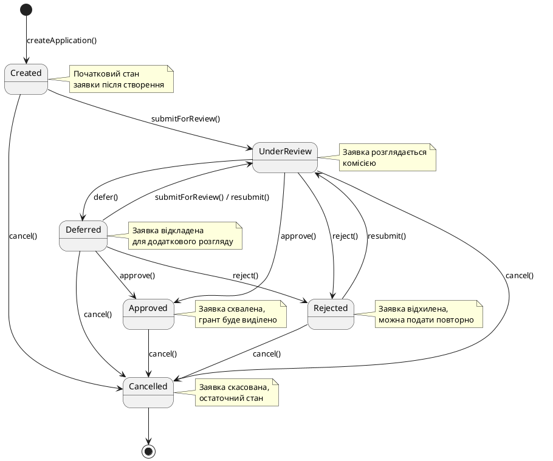
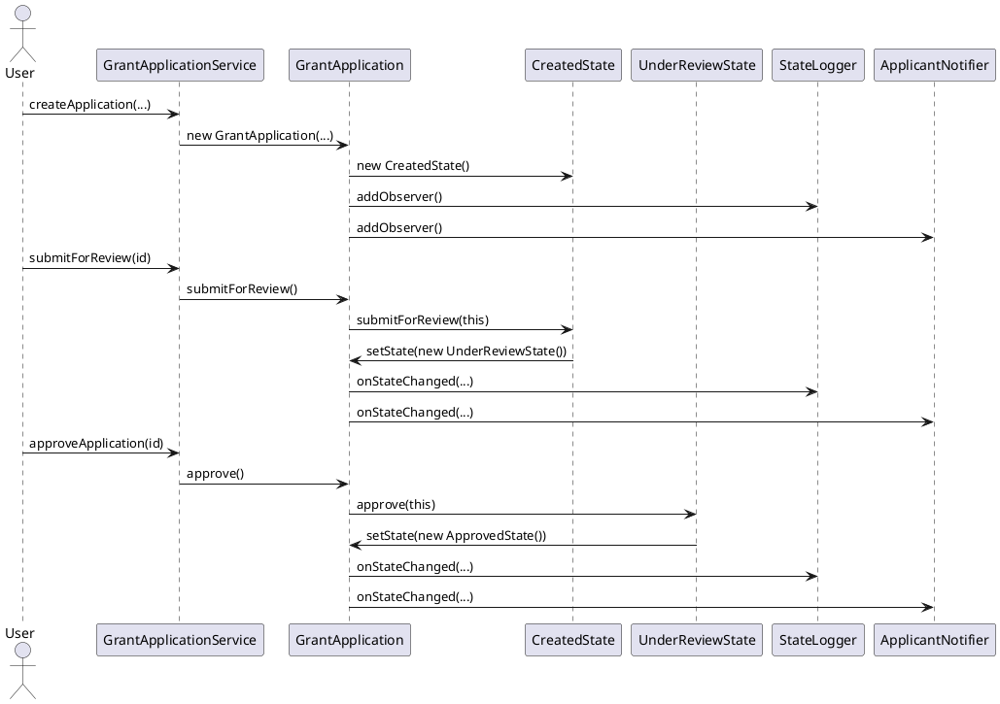
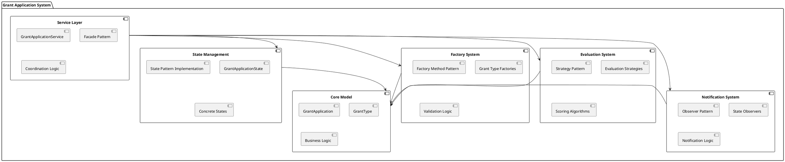

# UML Діаграми системи управління заявками на гранти

## Діаграма класів (Class Diagram)

```plantuml
@startuml GrantApplicationSystem

package "Model" {
    enum GrantType {
        RESEARCH
        EDUCATIONAL
        STARTUP
        SOCIAL
        CULTURAL
        +getDescription()
    }
    
    class GrantApplication {
        -id: String
        -applicantName: String
        -projectTitle: String
        -requestedAmount: double
        -grantType: GrantType
        -state: GrantApplicationState
        -observers: List<StateObserver>
        -createdAt: LocalDateTime
        -rejectionReason: String
        -approvalComments: String
        
        +submitForReview()
        +approve()
        +reject(reason: String)
        +defer()
        +cancel()
        +resubmit()
        +setState(newState: GrantApplicationState)
        +addObserver(observer: StateObserver)
        +removeObserver(observer: StateObserver)
    }
}

package "State Pattern" {
    interface GrantApplicationState {
        +submitForReview(application: GrantApplication)
        +approve(application: GrantApplication)
        +reject(application: GrantApplication)
        +defer(application: GrantApplication)
        +cancel(application: GrantApplication)
        +resubmit(application: GrantApplication)
        +getStateName(): String
        +getDescription(): String
    }
    
    class CreatedState implements GrantApplicationState
    class UnderReviewState implements GrantApplicationState
    class ApprovedState implements GrantApplicationState
    class RejectedState implements GrantApplicationState
    class DeferredState implements GrantApplicationState
    class CancelledState implements GrantApplicationState
}

package "Observer Pattern" {
    interface StateObserver {
        +onStateChanged(application: GrantApplication, oldState: GrantApplicationState, newState: GrantApplicationState)
    }
    
    class StateLogger implements StateObserver
    class ApplicantNotifier implements StateObserver
}

package "Factory Method Pattern" {
    abstract class GrantApplicationFactory {
        +createGrantApplication(id: String, applicantName: String, projectTitle: String, requestedAmount: double): GrantApplication
        +getGrantType(): GrantType
        #getFactoryGrantType(): GrantType
        +validateApplication(applicantName: String, projectTitle: String, requestedAmount: double): boolean
        #getMaxAmount(): double
        #performSpecificValidation(...): boolean
    }
    
    class ResearchGrantFactory extends GrantApplicationFactory
    class EducationalGrantFactory extends GrantApplicationFactory
    class StartupGrantFactory extends GrantApplicationFactory
    class SocialGrantFactory extends GrantApplicationFactory
    class CulturalGrantFactory extends GrantApplicationFactory
}

package "Strategy Pattern" {
    interface EvaluationStrategy {
        +evaluateApplication(application: GrantApplication): double
        +getEvaluationCriteria(): String
    }
    
    class AmountBasedEvaluation implements EvaluationStrategy
    class GrantTypeBasedEvaluation implements EvaluationStrategy
    class CompositeEvaluation implements EvaluationStrategy
}

package "Service" {
    class GrantApplicationService {
        -applications: Map<String, GrantApplication>
        -factories: Map<GrantType, GrantApplicationFactory>
        -evaluationStrategy: EvaluationStrategy
        -stateLogger: StateLogger
        -applicantNotifier: ApplicantNotifier
        
        +createApplication(...): GrantApplication
        +getApplication(id: String): GrantApplication
        +evaluateApplication(id: String): double
        +submitForReview(id: String)
        +approveApplication(id: String)
        +rejectApplication(id: String, reason: String)
        +deferApplication(id: String)
        +cancelApplication(id: String)
        +resubmitApplication(id: String)
        +setEvaluationStrategy(strategy: EvaluationStrategy)
    }
}

' Relationships
GrantApplication --> GrantType
GrantApplication --> GrantApplicationState
GrantApplication --> StateObserver

GrantApplicationService --> GrantApplication
GrantApplicationService --> GrantApplicationFactory
GrantApplicationService --> EvaluationStrategy
GrantApplicationService --> StateObserver

CompositeEvaluation --> AmountBasedEvaluation
CompositeEvaluation --> GrantTypeBasedEvaluation

@enduml
```

## Діаграма станів (State Diagram)

## Діаграма послідовності для State Pattern

## Діаграма компонентів системи

## Використані шаблони проектування

### 1. **State Pattern** (Основний)
- **Мета**: Управління станами заявки на грант
- **Учасники**: GrantApplicationState, ConcreteStates, GrantApplication (Context)
- **Переваги**: Чітке розділення логіки станів, легке додавання нових станів

### 2. **Observer Pattern**
- **Мета**: Сповіщення про зміни станів
- **Учасники**: StateObserver, StateLogger, ApplicantNotifier
- **Переваги**: Слабкий зв'язок, легке додавання нових спостерігачів

### 3. **Factory Method Pattern**
- **Мета**: Створення різних типів грантів з валідацією
- **Учасники**: GrantApplicationFactory, ConcreteFactories
- **Переваги**: Інкапсуляція створення, специфічна валідація

### 4. **Strategy Pattern**
- **Мета**: Різні алгоритми оцінки заявок
- **Учасники**: EvaluationStrategy, ConcreteStrategies
- **Переваги**: Гнучкість у виборі алгоритму, легке тестування

### 5. **Facade Pattern** (неявно)
- **Мета**: Спрощення інтерфейсу системи
- **Учасник**: GrantApplicationService
- **Переваги**: Єдина точка входу, приховування складності
