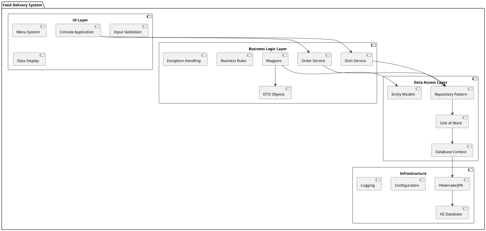
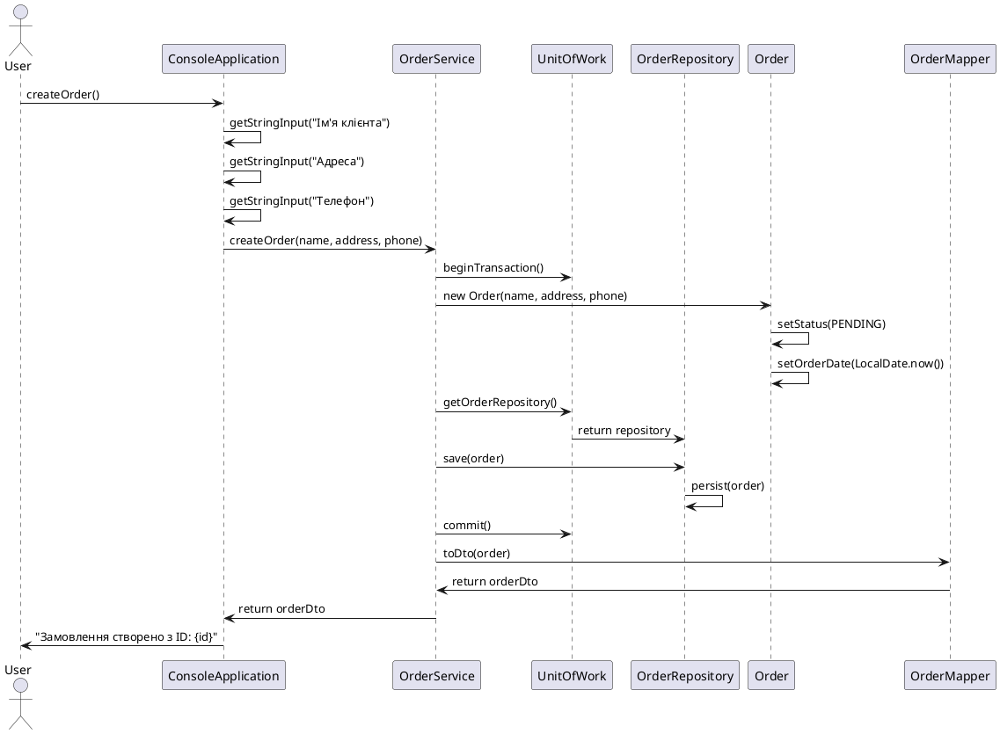
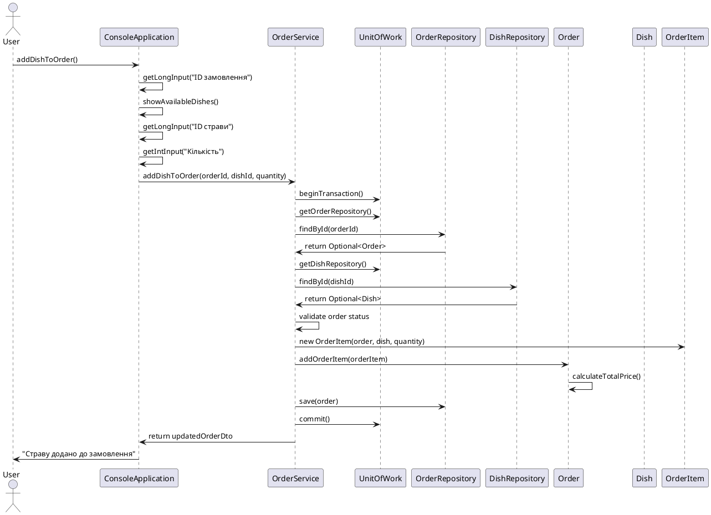
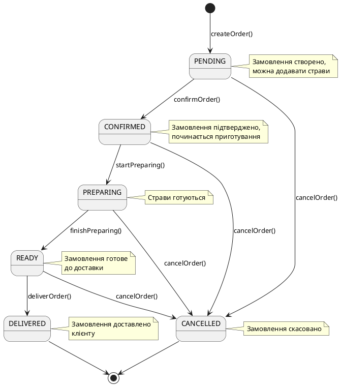
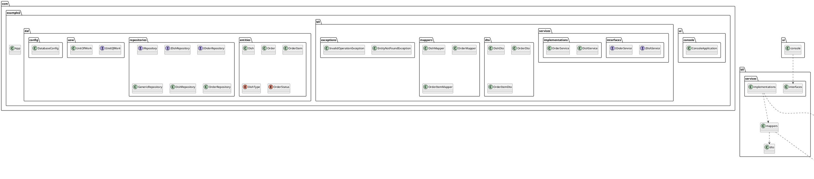

# UML Діаграми системи доставки їжі

## Діаграма класів (Class Diagram)

```plantuml
@startuml FoodDeliverySystem

package "DAL (Data Access Layer)" {
    package "Entities" {
        enum DishType {
            SOUP
            MAIN_COURSE
            SALAD
            DESSERT
            BEVERAGE
            +getDisplayName(): String
        }
        
        enum OrderStatus {
            PENDING
            CONFIRMED
            PREPARING
            READY
            DELIVERED
            CANCELLED
            +getDisplayName(): String
        }
        
        class Dish {
            -id: Long
            -name: String
            -description: String
            -price: Double
            -type: DishType
            -isAvailable: Boolean
            -availableDate: LocalDate
            
            +getId(): Long
            +getName(): String
            +getDescription(): String
            +getPrice(): Double
            +getType(): DishType
            +getIsAvailable(): Boolean
            +getAvailableDate(): LocalDate
            +setters()
            +toString(): String
        }
        
        class Order {
            -id: Long
            -customerName: String
            -customerAddress: String
            -customerPhone: String
            -orderDate: LocalDate
            -status: OrderStatus
            -totalPrice: Double
            -isComplexLunch: Boolean
            -orderItems: List~OrderItem~
            
            +addOrderItem(item: OrderItem)
            +removeOrderItem(item: OrderItem)
            +calculateTotalPrice(): Double
            +getId(): Long
            +getCustomerName(): String
            +getStatus(): OrderStatus
            +getTotalPrice(): Double
            +getOrderItems(): List~OrderItem~
            +setters()
        }
        
        class OrderItem {
            -id: Long
            -order: Order
            -dish: Dish
            -quantity: Integer
            -price: Double
            
            +calculateItemPrice(): Double
            +getId(): Long
            +getOrder(): Order
            +getDish(): Dish
            +getQuantity(): Integer
            +getPrice(): Double
            +setters()
            +toString(): String
        }
    }
    
    package "Repositories" {
        interface "IRepository~T~" {
            +findAll(): List~T~
            +findById(id: Long): Optional~T~
            +save(entity: T): T
            +delete(entity: T): void
            +deleteById(id: Long): void
        }
        
        interface IDishRepository {
            +findByType(type: DishType): List~Dish~
            +findByAvailableDate(date: LocalDate): List~Dish~
            +findAvailableDishes(): List~Dish~
            +findByNameContaining(name: String): List~Dish~
            +findByPriceBetween(minPrice: Double, maxPrice: Double): List~Dish~
        }
        
        interface IOrderRepository {
            +findByStatus(status: OrderStatus): List~Order~
            +findByCustomerName(customerName: String): List~Order~
            +findByOrderDate(date: LocalDate): List~Order~
        }
        
        class "GenericRepository~T~" {
            -entityManagerFactory: EntityManagerFactory
            -entityClass: Class~T~
            
            +findAll(): List~T~
            +findById(id: Long): Optional~T~
            +save(entity: T): T
            +delete(entity: T): void
            +deleteById(id: Long): void
            #getEntityManager(): EntityManager
        }
        
        class DishRepository {
            +findByType(type: DishType): List~Dish~
            +findByAvailableDate(date: LocalDate): List~Dish~
            +findAvailableDishes(): List~Dish~
            +findByNameContaining(name: String): List~Dish~
            +findByPriceBetween(minPrice: Double, maxPrice: Double): List~Dish~
        }
        
        class OrderRepository {
            +findByStatus(status: OrderStatus): List~Order~
            +findByCustomerName(customerName: String): List~Order~
            +findByOrderDate(date: LocalDate): List~Order~
        }
    }
    
    package "Unit of Work" {
        interface IUnitOfWork {
            +getDishRepository(): IDishRepository
            +getOrderRepository(): IOrderRepository
            +beginTransaction(): void
            +commit(): void
            +rollback(): void
            +close(): void
        }
        
        class UnitOfWork implements IUnitOfWork {
            -entityManager: EntityManager
            -dishRepository: IDishRepository
            -orderRepository: IOrderRepository
            -transaction: EntityTransaction
            
            +getDishRepository(): IDishRepository
            +getOrderRepository(): IOrderRepository
            +beginTransaction(): void
            +commit(): void
            +rollback(): void
            +close(): void
        }
    }
    
    package "Configuration" {
        class DatabaseConfig {
            -PERSISTENCE_UNIT_NAME: String
            -entityManagerFactory: EntityManagerFactory
            
            +getEntityManagerFactory(): EntityManagerFactory
            +closeEntityManagerFactory(): void
        }
    }
}

package "BLL (Business Logic Layer)" {
    package "DTOs" {
        class DishDto {
            -id: Long
            -name: String
            -description: String
            -price: Double
            -type: DishType
            -isAvailable: Boolean
            -availableDate: LocalDate
            
            +constructors()
            +getters_setters()
            +toString(): String
        }
        
        class OrderDto {
            -id: Long
            -customerName: String
            -customerAddress: String
            -customerPhone: String
            -orderDate: LocalDate
            -status: OrderStatus
            -totalPrice: Double
            -isComplexLunch: Boolean
            -orderItems: List~OrderItemDto~
            
            +constructors()
            +getters_setters()
        }
        
        class OrderItemDto {
            -id: Long
            -dishId: Long
            -dishName: String
            -quantity: Integer
            -price: Double
            
            +constructors()
            +getters_setters()
            +toString(): String
        }
    }
    
    package "Mappers" {
        class DishMapper {
            +toDto(entity: Dish): DishDto
            +toEntity(dto: DishDto): Dish
            +toDtoList(entities: List~Dish~): List~DishDto~
        }
        
        class OrderMapper {
            +toDto(entity: Order): OrderDto
            +toEntity(dto: OrderDto): Order
            +toDtoList(entities: List~Order~): List~OrderDto~
        }
        
        class OrderItemMapper {
            +toDto(entity: OrderItem): OrderItemDto
            +toEntity(dto: OrderItemDto): OrderItem
        }
    }
    
    package "Services" {
        interface IDishService {
            +getAllDishes(): List~DishDto~
            +getDishById(id: Long): DishDto
            +createDish(dishDto: DishDto): DishDto
            +updateDish(dishDto: DishDto): DishDto
            +deleteDish(id: Long): void
            +getDishesByType(type: DishType): List~DishDto~
            +getDishesByDate(date: LocalDate): List~DishDto~
            +getAvailableDishes(): List~DishDto~
            +searchDishesByName(name: String): List~DishDto~
            +getDishesByPriceRange(minPrice: Double, maxPrice: Double): List~DishDto~
        }
        
        interface IOrderService {
            +getAllOrders(): List~OrderDto~
            +getOrderById(id: Long): OrderDto
            +createOrder(customerName: String, customerAddress: String, customerPhone: String): OrderDto
            +addDishToOrder(orderId: Long, dishId: Long, quantity: Integer): OrderDto
            +removeItemFromOrder(orderId: Long, dishId: Long): OrderDto
            +confirmOrder(orderId: Long): OrderDto
            +updateOrderStatus(orderId: Long, status: OrderStatus): OrderDto
            +getOrdersByStatus(status: OrderStatus): List~OrderDto~
            +getOrdersByCustomer(customerName: String): List~OrderDto~
        }
        
        class DishService {
            -unitOfWork: IUnitOfWork
            
            +getAllDishes(): List~DishDto~
            +getDishById(id: Long): DishDto
            +createDish(dishDto: DishDto): DishDto
            +updateDish(dishDto: DishDto): DishDto
            +deleteDish(id: Long): void
            +getDishesByType(type: DishType): List~DishDto~
            +getDishesByDate(date: LocalDate): List~DishDto~
            +getAvailableDishes(): List~DishDto~
            +searchDishesByName(name: String): List~DishDto~
            +getDishesByPriceRange(minPrice: Double, maxPrice: Double): List~DishDto~
        }
        
        class OrderService {
            -unitOfWork: IUnitOfWork
            
            +getAllOrders(): List~OrderDto~
            +getOrderById(id: Long): OrderDto
            +createOrder(customerName: String, customerAddress: String, customerPhone: String): OrderDto
            +addDishToOrder(orderId: Long, dishId: Long, quantity: Integer): OrderDto
            +removeItemFromOrder(orderId: Long, dishId: Long): OrderDto
            +confirmOrder(orderId: Long): OrderDto
            +updateOrderStatus(orderId: Long, status: OrderStatus): OrderDto
            +getOrdersByStatus(status: OrderStatus): List~OrderDto~
            +getOrdersByCustomer(customerName: String): List~OrderDto~
        }
    }
    
    package "Exceptions" {
        class EntityNotFoundException extends RuntimeException {
            +EntityNotFoundException(message: String)
            +EntityNotFoundException(entityType: String, id: Long)
        }
        
        class InvalidOperationException extends RuntimeException {
            +InvalidOperationException(message: String)
        }
    }
}

package "UI (User Interface Layer)" {
    package "Console" {
        class ConsoleApplication {
            -dishService: IDishService
            -orderService: IOrderService
            -scanner: Scanner
            
            +run(): void
            +showMainMenu(): void
            +showDishesMenu(): void
            +showOrdersMenu(): void
            +showSearchMenu(): void
            -showAllDishes(): void
            -showDishesByType(): void
            -showDishesByDate(): void
            -showAvailableDishes(): void
            -addNewDish(): void
            -createOrder(): void
            -showAllOrders(): void
            -addDishToOrder(): void
            -confirmOrder(): void
            -searchDishesByName(): void
            -searchDishesByPriceRange(): void
            -searchOrdersByCustomer(): void
            -initializeSampleDataIfNeeded(): void
            -initializeSampleData(): void
            -getStringInput(prompt: String): String
            -getIntInput(prompt: String): int
            -getLongInput(prompt: String): long
            -getDoubleInput(prompt: String): double
            -waitForEnter(): void
            -confirmAction(action: String): boolean
        }
    }
}

package "Main Application" {
    class App {
        -UTF8_ENCODING: String
        -logger: Logger
        
        +main(args: String[]): void
    }
}

' Relationships
Order ||--o{ OrderItem : contains
OrderItem }o--|| Dish : references
Order ||--|| OrderStatus : has
Dish ||--|| DishType : has

"IRepository~T~" <|-- IDishRepository : extends
"IRepository~T~" <|-- IOrderRepository : extends
"GenericRepository~T~" ..|> "IRepository~T~" : implements
DishRepository --|> "GenericRepository~T~" : extends
OrderRepository --|> "GenericRepository~T~" : extends
DishRepository ..|> IDishRepository : implements
OrderRepository ..|> IOrderRepository : implements

UnitOfWork --> IDishRepository : uses
UnitOfWork --> IOrderRepository : uses
IUnitOfWork <|.. UnitOfWork : implements

IDishService <|.. DishService : implements
IOrderService <|.. OrderService : implements
DishService --> IUnitOfWork : uses
OrderService --> IUnitOfWork : uses
DishService --> DishMapper : uses
OrderService --> OrderMapper : uses
OrderService --> OrderItemMapper : uses

ConsoleApplication --> IDishService : uses
ConsoleApplication --> IOrderService : uses

App --> ConsoleApplication : creates

DishMapper ..> Dish : maps
DishMapper ..> DishDto : maps
OrderMapper ..> Order : maps
OrderMapper ..> OrderDto : maps
OrderItemMapper ..> OrderItem : maps
OrderItemMapper ..> OrderItemDto : maps

EntityNotFoundException --|> RuntimeException : extends
InvalidOperationException --|> RuntimeException : extends
OrderService ..> EntityNotFoundException : throws
OrderService ..> InvalidOperationException : throws

@enduml
```

## Діаграма компонентів (Component Diagram)

## Діаграма послідовності створення замовлення

## Діаграма послідовності додавання страви до замовлення

## Діаграма станів замовлення

## Діаграма пакетів системи

## Використані архітектурні патерни

### 1. **Багаторівнева архітектура (Multi-tier Architecture)**
- **UI Layer**: Консольний інтерфейс користувача
- **BLL Layer**: Бізнес-логіка та сервіси
- **DAL Layer**: Доступ до даних та збереження

### 2. **Repository Pattern**
- **Мета**: Абстракція доступу до даних
- **Учасники**: IRepository, GenericRepository, DishRepository, OrderRepository
- **Переваги**: Інкапсуляція логіки доступу до даних, тестованість

### 3. **Unit of Work Pattern**
- **Мета**: Управління транзакціями та життєвим циклом об'єктів
- **Учасники**: IUnitOfWork, UnitOfWork
- **Переваги**: Консистентність даних, управління транзакціями

### 4. **Data Transfer Object (DTO) Pattern**
- **Мета**: Передача даних між шарами
- **Учасники**: DishDto, OrderDto, OrderItemDto
- **Переваги**: Розділення моделей даних та бізнес-об'єктів

### 5. **Mapper Pattern**
- **Мета**: Перетворення між DTO та Entity об'єктами
- **Учасники**: DishMapper, OrderMapper, OrderItemMapper
- **Переваги**: Чіткий розділ відповідальності

### 6. **Service Layer Pattern**
- **Мета**: Інкапсуляція бізнес-логіки
- **Учасники**: IDishService, IOrderService, DishService, OrderService
- **Переваги**: Централізація бізнес-правил

### 7. **Dependency Injection (через конструктори)**
- **Мета**: Слабка зв'язаність компонентів
- **Переваги**: Тестованість, гнучкість, розширюваність
